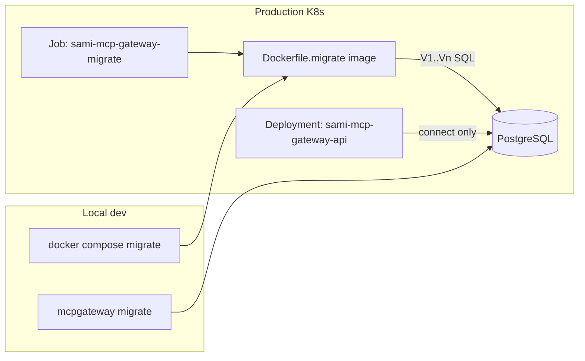

# Add Flyway for schema creation and management

## Current state

Schema is managed in-process via [`internal/migrations/migration.go`](internal/migrations/migration.go):

- GORM `AutoMigrate` for ~20 models
- Ad hoc PostgreSQL `ALTER TABLE` / `UPDATE` backfills (audit columns, tenant IDs, role rename, default tenant seed)
- Invoked synchronously from [`cmd/start.go`](cmd/start.go) on every startup
- No version tracking; one orphan SQL file at [`internal/migrations/sql/001_skills_catalog.up.sql`](internal/migrations/sql/001_skills_catalog.up.sql) is **not** executed

Tests and local fallback use **SQLite in-memory** via [`pkg/testhelpers/testhelpers.go`](pkg/testhelpers/testhelpers.go) and [`internal/db/db.go`](internal/db/db.go).

## Target architecture



- **Flyway owns DDL + one-time data migrations** (versioned, tracked in `flyway_schema_history`)
- **`start` no longer migrates** — fails fast if `DATABASE_URL` (or `POSTGRES_*`) is missing
- **SQLite removed** — Postgres everywhere (prod, docker, tests)
- **GORM models stay** as the application ORM layer; they must stay aligned with Flyway SQL but no longer drive schema creation
- **One migrate image** (`Dockerfile.migrate`) used in K8s Jobs, CI, and docker-compose — same SQL bundle everywhere

## 1. Flyway layout and config

Create:

| Path | Purpose |
|------|---------|
| [`db/migration/`](db/migration/) | Versioned SQL migrations (`V1__...sql`, `V2__...sql`, …) |
| [`db/flyway.conf`](db/flyway.conf) | Flyway config (`locations=filesystem:/flyway/sql`, placeholders) |

Recommended migration split:

- **`V1__baseline_schema.sql`** — full current desired schema (all tables, indexes, FKs, audit columns). Source of truth: run existing `migrations.Migrate` once against an empty Postgres 17 instance, then `pg_dump --schema-only`, clean up GORM noise, and commit. **Do not** reuse [`001_skills_catalog.up.sql`](internal/migrations/sql/001_skills_catalog.up.sql) as-is — it uses `created_at`/`updated_at` and `TEXT[]` for `allowed_tools`, while GORM models in [`internal/model/skill.go`](internal/model/skill.go) use `AuditFields` and `jsonb`.
- **`V2__data_backfills.sql`** — port idempotent one-time data steps from `migration.go`:
  - `server_kind` default on `mcp_servers`
  - `admin` → `administrator` role rename
  - `teams.created_by_user_id` backfill from team owners
  - `tenant_id` backfills across tenant-scoped tables
  - insert default tenant row (`DEFAULT_TENANT_ID`, default `sid-agentic` / `sami` per env)
  - seed `tenant_memberships` from existing users (mirror `backfillTenantRegistry` logic in SQL)

Future schema changes: add `V3__...sql`, `V4__...sql`, etc. — **never** edit applied migrations.

Delete or relocate the unused [`internal/migrations/sql/`](internal/migrations/sql/) directory after baseline is committed under `db/migration/`.

## 2. `Dockerfile.migrate` (production / K8s)

Add [`Dockerfile.migrate`](Dockerfile.migrate) — a **self-contained migrate image** (no host volume mounts required in K8s).

```dockerfile
# Build: docker build -f Dockerfile.migrate -t sidgs.jfrog.io/sami/sami-mcp-gateway-migrate:${TAG} .
FROM flyway/flyway:10-alpine

# Bundled migrations — baked into the image at build time
COPY db/migration/ /flyway/sql/
COPY db/flyway.conf /flyway/conf/flyway.conf

# Default command; override in K8s for baseline/info/validate
ENTRYPOINT ["flyway", "-configFiles=/flyway/conf/flyway.conf"]
CMD ["migrate"]
```

Design choices:

- **Base image:** official `flyway/flyway:10-alpine` — no custom Java/Go runtime needed for prod migrations
- **SQL baked in at build time** — each release tag carries its own migration set; K8s Job runs the image matching the API release
- **No `DATABASE_URL` parsing in the image** — Flyway native env vars (standard in K8s secrets):
  - `FLYWAY_URL` — e.g. `jdbc:postgresql://postgres-dev-sl.sidglobal.cloud:5432/sami-mcp-gateway-enterprise`
  - `FLYWAY_USER` / `FLYWAY_PASSWORD` — from K8s Secret
  - Optional: `FLYWAY_BASELINE_ON_MIGRATE`, `FLYWAY_BASELINE_VERSION` for cutover (see section 9)
- **Command override:** pass args to the container to run other Flyway commands:
  - `migrate` (default) — apply pending migrations
  - `info` — print migration status (debug Job)
  - `validate` — CI / pre-deploy check
  - `baseline -baselineVersion=1` — one-time cutover Job

Publish alongside API image to the same registry (e.g. `sidgs.jfrog.io/sami/sami-mcp-gateway-migrate:${SAMI_MCP_GATEWAY_IMAGE_TAG}`).

### K8s deployment pattern

Run migrations as a **Job before rolling out the API Deployment** (Helm pre-upgrade hook, Argo CD PreSync, or manual `kubectl apply`):

```yaml
apiVersion: batch/v1
kind: Job
metadata:
  name: sami-mcp-gateway-migrate
  annotations:
    # Optional: Helm hook — runs before api upgrade, deleted on success
    helm.sh/hook: pre-upgrade,pre-install
    helm.sh/hook-weight: "-5"
    helm.sh/hook-delete-policy: before-hook-creation,hook-succeeded
spec:
  backoffLimit: 3
  ttlSecondsAfterFinished: 86400
  template:
    spec:
      restartPolicy: Never
      containers:
        - name: migrate
          image: sidgs.jfrog.io/sami/sami-mcp-gateway-migrate:${TAG}
          env:
            - name: FLYWAY_URL
              value: jdbc:postgresql://postgres-dev-sl.sidglobal.cloud:5432/sami-mcp-gateway-enterprise
          envFrom:
            - secretRef:
                name: sami-mcp-gateway-db   # FLYWAY_USER, FLYWAY_PASSWORD
```

Operational notes for K8s:

- **Do not** run migrate as an API init container on every pod restart — use a Job (once per deploy) to avoid concurrent migration races
- API Deployment should **not** depend on migrate at pod level; pipeline order is: build migrate image → run Job → deploy API
- Job `backoffLimit: 3` surfaces Flyway failures clearly; failed Job blocks release
- For existing GORM-managed DBs, run a one-off Job with `args: ["baseline", "-baselineVersion=1"]` before the first normal migrate Job

Optional: add [`deploy/k8s/migrate-job.yaml`](deploy/k8s/migrate-job.yaml) as a reference manifest (not wired to a specific cluster).

## 3. New `migrate` CLI command (local / CI without Docker)

Add [`cmd/migrate.go`](cmd/migrate.go) registered on `rootCmd`:

```go
// mcpgateway migrate [--dry-run] [--baseline-version N]
```

Implementation in new [`internal/migrations/flyway.go`](internal/migrations/flyway.go):

- Resolve DSN the same way as [`cmd/start.go`](cmd/start.go) (`DATABASE_URL` → `POSTGRES_*` → error)
- Parse Postgres URL into Flyway JDBC form (`jdbc:postgresql://host:port/db`)
- `exec.Command("flyway", "-configFiles=db/flyway.conf", "migrate")` with env overrides (`FLYWAY_URL`, `FLYWAY_USER`, `FLYWAY_PASSWORD`)
- Subcommands/flags: `migrate`, `info`, `validate`, `baseline` (for existing DB cutover)

**Prerequisite for CLI:** Flyway CLI on PATH locally. **Production path:** use `Dockerfile.migrate` image in K8s Job instead.

## 4. Decouple migrations from startup

In [`cmd/start.go`](cmd/start.go):

- Remove `migrations.Migrate(dbConn)` block (lines ~669–674)
- Require a non-empty Postgres DSN before connecting; return a clear error: *"database not configured; run migrate Job or `mcpgateway migrate` first"*
- Optionally add a lightweight startup check: query `information_schema.tables` for a sentinel table (e.g. `mcp_servers`) and fail if missing — avoids opaque runtime errors later

## 5. Postgres-only database layer

In [`internal/db/db.go`](internal/db/db.go):

- Remove SQLite fallback, `getSQLiteDBPath`, and `github.com/glebarez/sqlite` import
- `NewDBConnection(dsn)` errors if `dsn == ""`
- Drop SQLite deps from [`go.mod`](go.mod): `github.com/glebarez/sqlite`, `gorm.io/driver/sqlite`

## 6. Docker Compose migrate service

Update [`docker-compose.yaml`](docker-compose.yaml) to **build from `Dockerfile.migrate`** (same image as K8s, not a separate flyway/flyway + volume mount):

```yaml
migrate:
  build:
    context: .
    dockerfile: Dockerfile.migrate
  image: sami-mcp-gateway-migrate:local
  environment:
    FLYWAY_URL: jdbc:postgresql://db:5432/sami
    FLYWAY_USER: sami
    FLYWAY_PASSWORD: sami
  depends_on:
    db:
      condition: service_healthy
  profiles: [enterprise]

api:
  depends_on:
    migrate:
      condition: service_completed_successfully
```

- Uncomment / wire local `db` service for enterprise profile
- Override `DATABASE_URL` for api to point at local `db` when using enterprise profile

## 7. Retire GORM migration package

- Delete [`internal/migrations/migration.go`](internal/migrations/migration.go) after SQL equivalents exist
- Delete or rewrite [`internal/migrations/migration_*_test.go`](internal/migrations/) — tests should validate Flyway SQL / integration, not Go `ALTER TABLE` helpers
- Replace all `migrations.Migrate(db)` call sites (~15 files) with a shared test helper that runs Flyway against Postgres

## 8. Tests: Postgres via testcontainers

Update [`pkg/testhelpers/testhelpers.go`](pkg/testhelpers/testhelpers.go):

- Add `github.com/testcontainers/testcontainers-go/modules/postgres`
- `CreateTestDB(t *testing.T) *gorm.DB`:
  - Start ephemeral Postgres 17 container (reuse with `sync.Once` per test process where practical)
  - Run Flyway migrate against it via `internal/migrations/flyway.go`
  - Return GORM postgres connection
- Change signature to require `*testing.T` (update ~10 call sites that use bare `CreateTestDB()`)
- `SetupTestDB` calls Flyway-backed `CreateTestDB` instead of `AutoMigrate`

Tests that inline `db.AutoMigrate(...)` should either use `CreateTestDB(t)` or a minimal subset helper — goal is one migration path.

**CI note:** testcontainers needs Docker available in CI; if CI lacks Docker, add a `TEST_DATABASE_URL` env fallback pointing at a service Postgres with pre-run migrate.

## 9. Existing production database cutover

For databases already created by GORM AutoMigrate (remote Postgres in compose default):

1. Deploy Flyway SQL that matches **current** live schema (baseline V1 must match reality — validate with `pg_dump` diff)
2. One-time K8s Job: `flyway baseline -baselineVersion=1` using migrate image with overridden args
3. Subsequent deploys run normal `migrate` Job (V2+ only)

Document this in a short comment atop `V1__baseline_schema.sql` and in the migrate command help text.

## 10. GORM model alignment (no AutoMigrate, but keep tags)

Keep GORM struct tags in [`internal/model/`](internal/model/) unchanged — they drive JSON/API behavior and query mapping. After Flyway baseline is generated, spot-check critical diffs:

- `AuditFields` (`created_on`, `created_by`, …) not `created_at`
- Skills use UUID PKs + `jsonb` for `allowed_tools`/`metadata`
- Partial unique indexes on `users` (`WHERE email <> ''`, `WHERE oidc_sub <> ''`)
- Soft delete (`deleted_at`) on `BaseModel` entities

## Risk / scope notes

- **Baseline accuracy** is the highest-risk step; pg_dump from a fresh AutoMigrate run is the safest bootstrap, then delete AutoMigrate.
- **Test runtime** will increase with testcontainers; mitigate with container reuse and `-short` skip if needed.
- **Breaking change** for anyone relying on SQLite file `./sami-mcp-gateway.db` without Postgres.
- **K8s release order:** migrate Job must succeed before API rollout; document in deploy runbook.

## Implementation order

1. Add `db/migration/V1` + `V2` SQL and `db/flyway.conf`
2. Add `Dockerfile.migrate` + optional `deploy/k8s/migrate-job.yaml` reference
3. Add `internal/migrations/flyway.go` + `cmd/migrate.go`
4. Remove startup migrate; enforce Postgres-only in `db.go` / `start.go`
5. Update docker-compose to build `Dockerfile.migrate`
6. Switch testhelpers to testcontainers + Flyway; update call sites
7. Delete old `migration.go` and orphan SQL; prune sqlite deps
8. Run full test suite; validate fresh DB, baselined DB, and K8s Job dry-run (`flyway info`)
