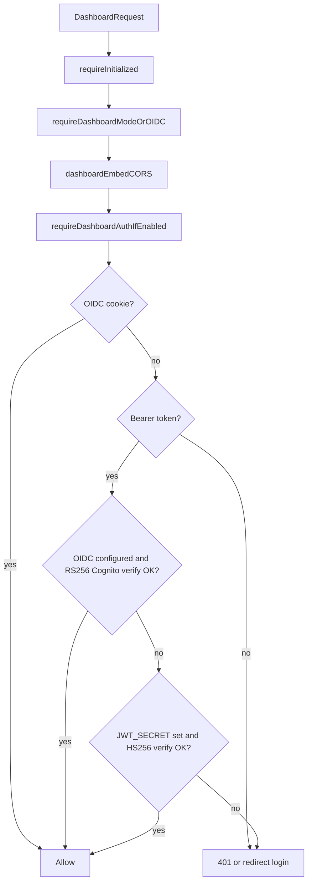

# Dual JWT auth for dashboard UI APIs

## Problem

Embedded/hosted UI calls [`/dashboard/*`](internal/api/server.go) with `Authorization: Bearer <jwt>` and `X-Tenant-ID`. Today only these auth paths work:

| Method | Where | Status |
|--------|-------|--------|
| Cognito browser cookie | `validOIDCSessionFromRequest` | Works |
| Cognito ID token (RS256) | `validOIDCBearerFromRequest` | Works when token is a real Cognito OIDC ID token |
| Platform JWT (HS256, `JWT_SECRET`) | — | **Not implemented** — your CMS token (`aud: sami-cms`, `tenant_id: bian-demo`) fails Cognito verification |

Separate issue already addressed in code (pending deploy): non-default tenants like `bian-demo` need auto-bootstrap via `resolveTenantConfig()` in [`requireInitialized()`](internal/api/middleware.go).

## Scope (confirmed)

- **In scope:** `/dashboard/*` accepts Cognito **or** platform JWT
- **Out of scope:** MCP routes (`/:tenant/mcp`, group MCP, agent-app OAuth) — keep [`GLOBAL_MCP_API_KEY`](internal/api/middleware.go) + [`checkAuthForGroupMcpProxyAccess`](internal/api/middleware.go) unchanged
- **Out of scope:** `/api/v0/*` — keep `GLOBAL_MCP_API_KEY` only
- **New secret:** `JWT_SECRET` (separate from `AGENT_APP_JWT_SIGNING_KEY`)

## Target auth flow



## Implementation

### 1. Wire `JWT_SECRET` into the server

- Add `JWTSecretEnvVar = "JWT_SECRET"` in [`cmd/start.go`](cmd/start.go)
- Pass trimmed secret into new `ServerOptions` field (e.g. `PlatformJWTSecret string`) in [`internal/api/server.go`](internal/api/server.go)
- Add to [`docker-compose.yaml`](docker-compose.yaml) (and optionally chart values) so local embed works:
  ```yaml
  JWT_SECRET: ${JWT_SECRET:-...}
  DASHBOARD_EMBED_ALLOWED_ORIGINS: ${DASHBOARD_EMBED_ALLOWED_ORIGINS:-http://localhost:5173}
  ```

Optional env for claim hardening (recommended, default sensible):
- `PLATFORM_JWT_AUD` (default `sami-cms`) — reject platform tokens with wrong `aud`

### 2. Add unified dashboard user session resolver

Create [`internal/api/ui_auth.go`](internal/api/ui_auth.go) (or extend [`oidc_auth.go`](internal/api/oidc_auth.go)) with:

**Shared session struct** (extend/rename `oidcServerSession` or add `dashboardUserSession`):
- `Sub`, `Email`, `ExpiresAt`
- `Source`: `cognito_cookie` | `cognito_bearer` | `platform_bearer`

**`validPlatformBearerFromRequest(c)`**
- Require non-empty `JWT_SECRET`
- Parse Bearer token; **reject `alg: none` / unsigned tokens**
- Verify **HS256** only with `JWT_SECRET` (same pattern as [`agentapp.ResolvePrincipalFromBearerJWT`](internal/service/agentapp/agentapp.go) but different claims)
- Validate standard claims: `exp`, `sub`
- Validate tenant: `tenant_id` or `custom:tenant_id` must match `X-Tenant-ID` when both present (reuse [`tenantIDFromOIDCBearerClaims`](internal/api/oidc_auth.go))
- Optional: validate `aud` against `PLATFORM_JWT_AUD`
- Do **not** require agent-app-specific claims (`agent_app_id`, agent-app issuer)

**`validDashboardUserFromRequest(c)`** — single entry point:
1. OIDC cookie session (existing)
2. Cognito bearer (existing `validOIDCBearerFromRequest`)
3. Platform bearer (new)

### 3. Update dashboard middleware and handlers

Replace internal calls in [`requireOIDCSessionIfEnabled`](internal/api/oidc_auth.go) to use `validDashboardUserFromRequest` (keep exported name or rename to `requireDashboardAuthIfEnabled` for clarity).

Update [`dashboardAuthStatusHandler`](internal/api/dashboard.go) to treat platform bearer as authenticated (same JSON shape as Cognito bearer today).

**Fix existing embed gap:** [`agentAppOwnerScopeFromDashboard`](internal/api/agent_apps.go) currently only accepts OIDC **cookies**, not bearer tokens — extend it to accept any valid dashboard user session (Cognito or platform bearer) so Agent Apps CRUD works in embed mode:
```go
if sess, ok := s.validDashboardUserFromRequest(c); ok {
    return "ui:" + sess.Sub, nil
}
```

### 4. Keep MCP / REST boundaries explicit

No changes to:
- [`checkAuthForMcpProxyAccess`](internal/api/middleware.go) — `GLOBAL_MCP_API_KEY`
- [`checkAuthForGroupMcpProxyAccess`](internal/api/middleware.go) — open / api_key / basic / **agent-app JWT** (`AGENT_APP_JWT_SIGNING_KEY`)
- [`verifyUserAuthForAPIAccess`](internal/api/middleware.go) — `GLOBAL_MCP_API_KEY` on `/api/v0`

This ensures agent credentials used for MCP never collide with UI user JWT validation on dashboard routes.

### 5. Tests

Add [`internal/api/ui_auth_test.go`](internal/api/ui_auth_test.go):
- Valid platform HS256 token with matching `tenant_id` + `X-Tenant-ID` → dashboard route 200
- Wrong signature / expired / `alg:none` → 401
- Tenant mismatch between JWT and header → rejected
- Cognito RS256 path still passes (reuse mock issuer from [`oidc_bearer_test.go`](internal/api/oidc_bearer_test.go))
- `requireOIDCSessionIfEnabled` accepts platform token when Cognito verify fails
- `agentAppOwnerScopeFromDashboard` works with platform bearer

### 6. Operator checklist (post-deploy)

For your curl/browser embed scenario:

1. Rebuild/restart API (includes tenant auto-bootstrap fix)
2. Set `JWT_SECRET` to match the platform issuer
3. Set `DASHBOARD_EMBED_ALLOWED_ORIGINS=http://localhost:5173` for browser CORS
4. Use a **signed** platform JWT (not `alg: none`)
5. Send matching `X-Tenant-ID: bian-demo` when JWT contains `tenant_id: bian-demo`

Example (after deploy):
```bash
curl 'http://localhost:18080/api/v1/sami-mcp-gateway/dashboard/overview' \
  -H 'Accept: application/json' \
  -H 'X-Tenant-ID: bian-demo' \
  -H 'Authorization: Bearer <platform-hs256-jwt>'
```

## Files to touch

| File | Change |
|------|--------|
| [`cmd/start.go`](cmd/start.go) | `JWT_SECRET` env, optional `PLATFORM_JWT_AUD` |
| [`internal/api/server.go`](internal/api/server.go) | `PlatformJWTSecret` option |
| [`internal/api/ui_auth.go`](internal/api/ui_auth.go) | **New** platform JWT + unified resolver |
| [`internal/api/oidc_auth.go`](internal/api/oidc_auth.go) | Dashboard auth middleware uses unified resolver |
| [`internal/api/dashboard.go`](internal/api/dashboard.go) | Auth-status accepts platform JWT |
| [`internal/api/agent_apps.go`](internal/api/agent_apps.go) | Dashboard owner scope from bearer sessions |
| [`docker-compose.yaml`](docker-compose.yaml) | `JWT_SECRET`, `DASHBOARD_EMBED_ALLOWED_ORIGINS` |
| [`internal/api/ui_auth_test.go`](internal/api/ui_auth_test.go) | **New** tests |

No dashboard frontend changes required — [`embedAuth.ts`](web/dashboard/src/lib/embedAuth.ts) already sends `Authorization: Bearer` + `X-Tenant-ID`.
