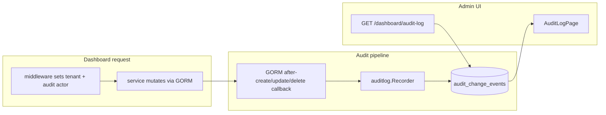

# Model Change Audit Log

## Context

The codebase already has **row-level audit metadata** ([`internal/model/audit.go`](internal/model/audit.go), [`pkg/auditctx/auditctx.go`](pkg/auditctx/auditctx.go)): each row stores who last created/updated it. That does **not** preserve history — only the latest actor/timestamp.

This feature adds a separate **append-only change log** so administrators and auditors can review *what changed, when, and by whom* across all mutable models in a tenant.



**Access (confirmed):** tenant **administrator** and **auditor** roles — same audience as Observability/Users list ([`CanAccessSystemSection()`](internal/authz/authz.go)). Append-only; no write endpoints.

---

## 1. Data model

Add [`internal/model/audit_change_event.go`](internal/model/audit_change_event.go):

| Column | Purpose |
|--------|---------|
| `id` | PK |
| `created_on` | When the change occurred (indexed) |
| `tenant_id` | Tenant scope (indexed composite with `created_on`) |
| `actor` | From `auditctx.ActorFrom(ctx)` — email, OIDC sub, or `user:{id}` |
| `action` | `create` \| `update` \| `delete` |
| `entity_type` | Stable snake_case label (e.g. `mcp_server`, `user`, `team_member`) |
| `entity_id` | Stringified PK (uint, UUID, or string tenant id) |
| `entity_label` | Optional human name (`name`, `username`, etc.) |
| `changes` | Optional JSON text — redacted snapshot or field diff |

Register in [`internal/migrations/migration.go`](internal/migrations/migration.go) via `AutoMigrate` (after existing models, before backfills complete — plugin registered **after** `Migrate()` in startup so backfills do not generate events).

**Excluded from logging** (not configuration mutations):
- `audit_change_events` itself (recursion)
- `tool_invocation_events` (runtime observability; separate from config audit)

---

## 2. Recording pipeline (GORM plugin)

New package [`internal/service/auditlog/`](internal/service/auditlog/):

- **`recorder.go`** — `Recorder` interface with `RecordChange(ctx, params)`; GORM implementation inserts rows (errors logged, never fail the originating mutation).
- **`plugin.go`** — `Register(db *gorm.DB, recorder Recorder)` hooks:
  - `Create` → after callback: action `create`, serialize `Statement.Dest`
  - `Update` → after callback: action `update`, capture changed fields when available (`Statement.Changed()` / dest struct), else post-update snapshot
  - `Delete` → before callback: action `delete`, capture row identity + minimal snapshot from `Statement.Dest` / `Statement.Model`
- **`entity.go`** — map GORM schema/table → `entity_type`; extract PK and label field via reflection (reuse patterns from [`internal/migrations/migration.go`](internal/migrations/migration.go) schema helpers).
- **`redact.go`** — strip or mask sensitive fields before JSON serialization:
  - `password_hash`, `secret_hash`, `access_token`, `refresh_token`, OAuth token fields, API keys
  - Use `"[REDACTED]"` placeholder

**Tenant resolution order:**
1. `tenant.FromContext(ctx)` when present
2. Else read `TenantID` field from the mutated struct
3. For `Tenant` rows, use `row.ID`
4. Fallback: `tenant.DefaultID` or empty string

**Actor:** always `auditctx.ActorFrom(db.Statement.Context)`.

**Registration timing:** in [`cmd/start.go`](cmd/start.go), call `auditlog.Register(db, recorder)` **after** `migrations.Migrate(db)` so historical backfills and `ensureAuditColumns` do not flood the log.

**Optional escape hatch:** add `auditctx.WithDisabled(ctx)` for future batch/internal jobs that should not emit events.

---

## 3. Query API

Add [`internal/api/dashboard_audit.go`](internal/api/dashboard_audit.go):

```
GET /dashboard/audit-log?range=24h|7d|30d&from=&to=&entity_type=&actor=&action=&limit=
```

- Gate with `p.CanAccessSystemSection()` (administrator + auditor) — mirror [`dashboardObservabilityHandler`](internal/api/dashboard.go).
- Tenant-scoped query: `WHERE tenant_id = ?` using request tenant context.
- Reuse time-window parsing from [`internal/service/dashboard/observability.go`](internal/service/dashboard/observability.go) (`parseObservabilityWindow`, `normalizeLimit`).
- Default limit 50, max 100; order by `created_on DESC`.

Add response types in [`pkg/types/audit_log.go`](pkg/types/audit_log.go):

```go
type AuditChangeEventPublic struct {
    ID          uint            `json:"id"`
    CreatedOn   time.Time       `json:"created_on"`
    Actor       string          `json:"actor"`
    Action      string          `json:"action"`
    EntityType  string          `json:"entity_type"`
    EntityID    string          `json:"entity_id"`
    EntityLabel string          `json:"entity_label,omitempty"`
    Changes     json.RawMessage `json:"changes,omitempty"`
}
type DashboardAuditLogResponse struct {
    Range  string                   `json:"range"`
    From   time.Time                `json:"from"`
    To     time.Time                `json:"to"`
    Events []AuditChangeEventPublic `json:"events"`
}
```

Wire route in [`internal/api/server.go`](internal/api/server.go) under the protected `/dashboard` group.

Query logic can live in `auditlog.Service` or extend [`internal/service/dashboard/service.go`](internal/service/dashboard/service.go) (follow observability pattern: dashboard service owns read aggregation).

---

## 4. Dashboard UI

Add [`web/dashboard/src/components/AuditLogPage.tsx`](web/dashboard/src/components/AuditLogPage.tsx) — table-first page modeled on [`ObservabilityPage.tsx`](web/dashboard/src/components/ObservabilityPage.tsx):

- Columns: **Time**, **Actor**, **Action**, **Entity** (type + label/id), **Changes** (expandable JSON panel or truncated preview)
- Filters: time range (24h / 7d / 30d), entity type dropdown, action, actor search
- Refresh button; loading/error/empty states via existing `SectionCard` / `EmptyStateCard`

Frontend wiring:
- [`web/dashboard/src/lib/types.ts`](web/dashboard/src/lib/types.ts) — add `"audit_log"` to `AppSection` + response types
- [`web/dashboard/src/lib/api.ts`](web/dashboard/src/lib/api.ts) — `fetchAuditLog(...)`
- [`web/dashboard/src/lib/navSections.ts`](web/dashboard/src/lib/navSections.ts) — add **Audit Log** under System group (after Users)
- [`web/dashboard/src/lib/rbac.ts`](web/dashboard/src/lib/rbac.ts) — gate nav with `canAccessSystemSection` (same as observability)
- [`web/dashboard/src/App.tsx`](web/dashboard/src/App.tsx) — section meta, conditional fetch (`fetchAuditLogIfAllowed`), render page

---

## 5. Entity coverage

The GORM plugin automatically covers all mutable models registered in migrations (~20 entity types):

`McpServer`, `Tool`, `Prompt`, `Resource`, `ServerConfig`, `User`, `ToolGroup`, `PromptGroup`, `AgentApp`, OAuth token/session tables, `Skill`/`SkillVersion`/`SkillSet`/`SkillSetMember`/`SkillScript`/`SkillReference`, `Team`/`TeamMember`/`TeamResourceAssignment`, `Tenant`, `TenantMembership`.

**Note:** Skill updates that delete+recreate child rows will produce multiple events (accurate but verbose). Bulk MCP catalog syncs will produce one event per row touched — acceptable for v1.

**Out of scope for v1:** backfilling historical changes from existing `updated_by` columns; platform-admin cross-tenant unified view (events still recorded with row tenant_id; platform admin sees them when operating in that tenant context).

---

## 6. Tests

| Test | Location |
|------|----------|
| Redaction strips secrets | `internal/service/auditlog/redact_test.go` |
| Entity extraction (PK, label, type) | `internal/service/auditlog/entity_test.go` |
| Plugin emits create/update/delete on sample model | `internal/service/auditlog/plugin_test.go` |
| API: admin/auditor 200, provider/user 403 | `internal/api/dashboard_audit_test.go` |
| Tenant isolation (tenant A cannot see tenant B events) | same API test |

Use in-memory SQLite + `auditctx.WithActor` + `tenant.WithContext` patterns from existing tests ([`dashboard_observability_test.go`](internal/api/dashboard_observability_test.go)).

---

## 7. Documentation

Brief addition to [`docs/governance/rbac-and-teams.mdx`](docs/governance/rbac-and-teams.mdx): Audit Log section under System, accessible to administrator and auditor, describes recorded fields and redaction policy. Update [`docs/support-matrix.mdx`](docs/support-matrix.mdx) Audit Logs row from "Limited" to reflect config change logging.

---

## Relationship to existing audit metadata

Keep [`AuditFields`](internal/model/audit.go) as-is (last-touch provenance on each row). The change log is complementary history. Optionally continue wiring `StampCreateFromCtx`/`StampUpdateFromCtx` in services that still skip it (MCP, skills, groups) — separate follow-up, not required for the event log since the GORM plugin captures writes regardless.
