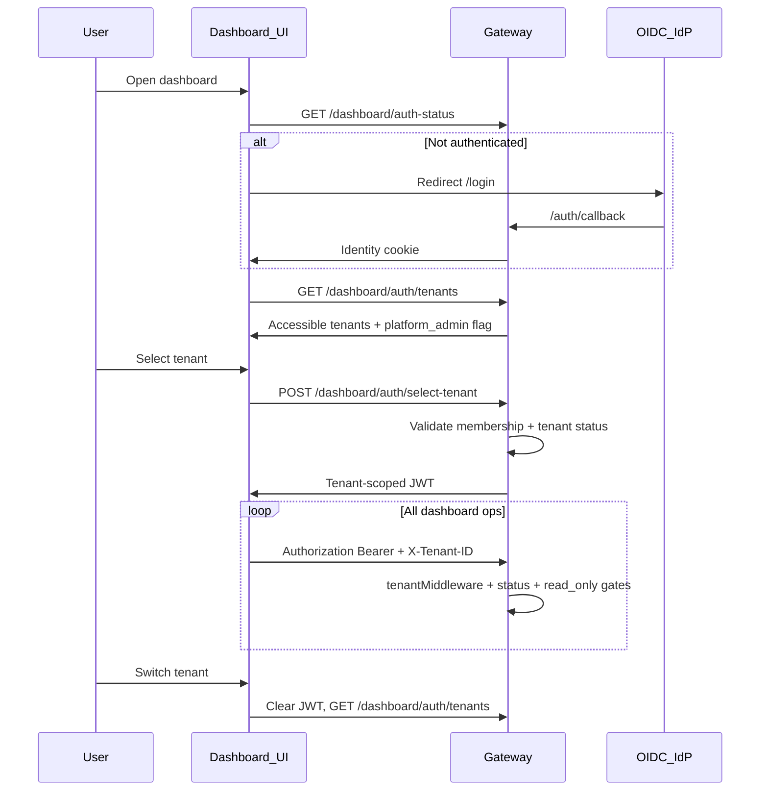

# Platform Administrator, Tenant Registry, and Tenant-Scoped Login

## Goals

- Add **platform administrator** — users whose email appears in `PLATFORM_ADMIN_LIST` (comma-separated).
- Add a **tenant registry** with lifecycle: create, suspend, retire (with effective date), soft-remove, and `read_only` mode.
- Support **multi-tenant membership** — one identity (OIDC `sub` / email) can belong to many tenants with a per-tenant role.
- Change login flow: **authenticate → pick tenant → receive tenant-scoped JWT** used for all dashboard API calls.
- Add **Tenant Admin** screen (System nav) for platform admins to manage tenants and tenant users.
- Add **tenant switcher** that returns to the accessible-tenant list and re-issues a JWT.
- Enforce **audit metadata on all models**: `created_by`, `created_on`, `updated_by`, `updated_on` — set on every mutating operation.

## Current state (baseline)

- Tenants are implicit strings (`tenant_id` on rows); no `tenants` table ([`internal/model/server_config.go`](internal/model/server_config.go) is the only per-tenant bootstrap record).
- Users are **one row per tenant** ([`internal/model/user.go`](internal/model/user.go)); lookups are always `dbTenant(ctx)`.
- OIDC cookie sessions store `sub` + `email` only — no tenant ([`internal/api/oidc_auth.go`](internal/api/oidc_auth.go)).
- Standalone dashboard sends **no** `X-Tenant-ID` / Bearer; embed mode does ([`web/dashboard/src/lib/embedAuth.ts`](web/dashboard/src/lib/embedAuth.ts)).
- Platform JWT is **validated** but not **minted** by the gateway ([`internal/api/ui_auth.go`](internal/api/ui_auth.go)); agent-app JWT mint exists as a reference ([`internal/service/agentapp/agentapp.go`](internal/service/agentapp/agentapp.go)).
- Most models embed `gorm.Model` (`CreatedAt`/`UpdatedAt` only) or custom timestamps ([`internal/model/skill.go`](internal/model/skill.go)); **no standard `created_by` / `updated_by`** except `Team.CreatedByUserID`.

## Audit fields (cross-cutting)

All persisted models must record **who** created/updated a row and **when**. Applies to existing models and new `Tenant` / `TenantMembership` models.

### Standard embed — [`internal/model/audit.go`](internal/model/audit.go) (new)

```go
type AuditFields struct {
    CreatedOn time.Time `json:"created_on" gorm:"column:created_on;not null"`
    CreatedBy string    `json:"created_by" gorm:"size:320;not null;default:system"`
    UpdatedOn time.Time `json:"updated_on" gorm:"column:updated_on;not null"`
    UpdatedBy string    `json:"updated_by" gorm:"size:320;not null;default:system"`
}
```

- **Replace** embedded `gorm.Model` on models that use it (avoids duplicate timestamp columns). Skill models with explicit `CreatedAt`/`UpdatedAt` migrate to `AuditFields` naming.
- **`Team.CreatedByUserID`** is superseded by `created_by` (backfill from owner email or `user:{id}`).

**Actor string (`created_by` / `updated_by`)**, resolved in order:
1. Dashboard principal email
2. Else OIDC `sub`
3. Else `user:{id}` (API-key / agent contexts)
4. `"system"` — migrations, bootstrap, background sync jobs, backfill

### Actor propagation — [`pkg/auditctx/auditctx.go`](pkg/auditctx/auditctx.go) (new)

- `WithActor(ctx, actor)`, `ActorFrom(ctx) string`
- Set in [`buildDashboardPrincipal`](internal/api/dashboard_principal.go) after auth resolves identity
- Platform-admin / tenant-registry services read actor from context

### Mutation helpers — [`internal/model/audit.go`](internal/model/audit.go)

```go
type Auditable interface { /* embed AuditFields accessors */ }
func StampCreate(rec Auditable, actor string, now time.Time)
func StampUpdate(rec Auditable, actor string, now time.Time)
```

Call **explicitly in the service layer** before every `Create`, `Save`, `Updates`, and soft-delete — not via GORM hooks alone (hooks cannot read request context).

### Models in scope

| File | Notes |
|------|-------|
| `user.go`, `team.go`, `server_config.go` | Replace `gorm.Model` |
| `mcp_server.go`, `mcp_tool.go`, `mcp_prompt.go`, `mcp_resource.go` | MCP catalog |
| `tool_group.go`, `prompt_group.go`, `agent_app.go` | Groups + agent apps |
| `skill.go` | Skill, SkillVersion, SkillSet, SkillSetMember |
| `upstream_oauth.go` | OAuth session + token rows |
| **New** `tenant.go`, `tenant_membership.go` | Include `AuditFields` from day one |
| `tool_invocation_event.go` | **Append-only**: set `created_on` + `created_by` on insert; no `updated_*` updates |

### Migration — [`internal/migrations/migration.go`](internal/migrations/migration.go)

- AutoMigrate `created_on`, `created_by`, `updated_on`, `updated_by` on all tables.
- Backfill: copy existing `created_at`/`updated_at` → `created_on`/`updated_on`; set `created_by`/`updated_by` = `'system'`.
- Drop legacy `created_at`/`updated_at` columns after backfill (single migration step per table).

### Service wiring (all mutation paths)

Stamp audit fields in every service that writes rows:
- `internal/service/user/`, `team/`, `mcp/*`, `toolgroup/`, `promptgroup/`, `skill/`, `skillset/`, `agentapp/`
- **New** `internal/service/tenantregistry/` — tenant lifecycle + membership CRUD
- MCP discovery/sync upserts: `updated_by=system`
- Login upserts (`UpsertFromDashboardSession`): actor = logging-in user's email

### API exposure

- Return audit fields on **Tenant Admin** list/detail and membership responses.
- Catalog dashboard responses may omit audit fields initially unless compliance UI is needed.

## Architecture



## Data model

### New tables ([`internal/model/`](internal/model/))

**`Tenant`**
| Field | Purpose |
|-------|---------|
| `ID` (string, PK) | `tenant_id` slug (validated via [`pkg/tenant/tenant.go`](pkg/tenant/tenant.go)) |
| `Name` | Display name |
| `Status` | `active` \| `suspended` \| `retired` \| `removed` |
| `Mode` | `normal` \| `read_only` |
| `RetireAt` | nullable; after this instant, tenant login blocked (platform admin exempt) |
| `OwnerEmail` | initial tenant owner email (informational; membership is source of truth) |
| `AuditFields` | `created_by`, `created_on`, `updated_by`, `updated_on` |

**`TenantMembership`**
| Field | Purpose |
|-------|---------|
| `TenantID` | FK to tenant |
| `OIDCSub` | global identity (primary lookup) |
| `Email` | denormalized for admin UI / env list matching |
| `Role` | tenant role: `administrator` \| `provider` \| `user` \| `auditor` |
| `AuditFields` | audit metadata |
| unique `(tenant_id, oidc_sub)` | one membership per identity per tenant |

Keep existing **`users`** rows per tenant for backward compatibility with teams/RBAC; on tenant selection / login, **upsert** `users` from membership (same as today’s `UpsertFromDashboardSession`, but role sourced from membership).

### Migration ([`internal/migrations/migration.go`](internal/migrations/migration.go))

- AutoMigrate `Tenant`, `TenantMembership`.
- Backfill: insert registry row for `DEFAULT_TENANT_ID`; create memberships from existing `users` (`oidc_sub`/`email` + role).
- Do **not** hard-delete on remove — set `status=removed`, block access, retain data (per your choice).

## Roles and env configuration

| Concept | Source | Scope |
|---------|--------|-------|
| **Platform administrator** | `PLATFORM_ADMIN_LIST` (comma-separated emails, case-insensitive) | Global; not stored in DB |
| **Tenant administrator** (incl. tenant owner) | `tenant_memberships.role` | Per tenant |
| Existing bootstrap | `BOOTSTRAP_ADMIN_EMAIL` / `BOOTSTRAP_ADMIN_SUB` | Keep; can coexist |

Add `types.UserRolePlatformAdministrator` or a separate `Principal.IsPlatformAdmin` flag (preferred: **boolean on session/JWT**, not mixed into tenant role enum).

Platform admins:
- See **Tenant Admin** screen.
- Appear in tenant picker with **all non-removed tenants** (per your choice).
- May enter **suspended / retired / read_only** tenants for maintenance; lifecycle rules below define what they can mutate.

## Auth & JWT

### New endpoints ([`internal/api/dashboard_auth_tenants.go`](internal/api/dashboard_auth_tenants.go) — new file)

| Method | Path | Auth | Purpose |
|--------|------|------|---------|
| GET | `/dashboard/auth/tenants` | Identity (OIDC cookie or bearer) | List accessible tenants with status/mode/role |
| POST | `/dashboard/auth/select-tenant` | Identity | Body `{ tenant_id }` → mint tenant JWT |
| POST | `/dashboard/auth/switch-tenant` | Identity | Alias / same handler; client clears old JWT first |

**Minted JWT** (reuse `platformBearerClaims` shape in [`internal/api/ui_auth.go`](internal/api/ui_auth.go), extend as needed):
- `sub`, `email`, `tenant_id`, `role` (tenant role), `platform_admin` (bool), `aud`, `exp`
- Signed with `JWT_SECRET` (HS256); **require `JWT_SECRET` in enterprise** when multi-tenant login is enabled (document fallback: dev mode may allow unsigned only for local testing).

**Identity step**: Extend OIDC session / dashboard auth to resolve identity **without** requiring tenant context on `/dashboard/auth/*` routes (new router group **before** tenant-scoped dashboard API, or exempt these paths from tenant user provisioning).

### Login gating rules ([`internal/service/tenantregistry/`](internal/service/tenantregistry/) — new service)

On `select-tenant`, reject unless:
- User has membership **or** is platform admin.
- Tenant `status` is `active`, or user is platform admin (suspended/retired allowed for maintenance).
- If `status=retired` and `now > retire_at`, reject for non-platform-admin.
- If `status=removed`, reject for everyone.

### Request middleware changes ([`internal/api/middleware.go`](internal/api/middleware.go), [`internal/api/dashboard_principal.go`](internal/api/dashboard_principal.go))

1. **`requireTenantOperational()`** — after tenant resolution, load tenant registry row; block non-platform-admin if suspended/retired-past-date/removed.
2. **`rejectReadOnlyTenantWrites()`** — on POST/PUT/PATCH/DELETE, if tenant `mode=read_only` and caller is not platform admin → 403.
3. **`buildDashboardPrincipal`** — derive tenant role from JWT claims + membership; set `IsPlatformAdmin` from claim/env re-check.
4. **OIDC cookie path**: After successful OIDC callback, redirect to `/#/select-tenant` (or dedicated route) instead of home.

## Platform Admin APIs

New routes under `/dashboard/platform/*`, gated by `requirePlatformAdmin()`:

| Endpoint | Action |
|----------|--------|
| GET/POST `/dashboard/platform/tenants` | List / create tenant (`name`, `tenant_id`, `owner_email`) |
| PATCH `/dashboard/platform/tenants/:id` | Update name, status, mode, `retire_at` |
| POST `/dashboard/platform/tenants/:id/suspend` | `status=suspended` |
| POST `/dashboard/platform/tenants/:id/retire` | `status=retired`, set `retire_at` |
| POST `/dashboard/platform/tenants/:id/remove` | `status=removed` (soft) |
| PATCH `/dashboard/platform/tenants/:id/mode` | `{ mode: normal \| read_only }` |
| GET/POST `/dashboard/platform/tenants/:id/members` | List / add member `{ email, role }` |
| PATCH/DELETE `/dashboard/platform/tenants/:id/members/:membershipId` | Update role / remove membership |

**Create tenant** side effects:
- Insert `tenants` row (`active`, `normal`).
- Create `tenant_memberships` for owner with `administrator`.
- Bootstrap `server_configs` row (reuse [`resolveTenantConfig`](internal/api/server.go) pattern).
- Upsert owner `users` row on first login.

## Frontend ([`web/dashboard/src/`](web/dashboard/src/))

### New flows in [`App.tsx`](web/dashboard/src/App.tsx)

```
checking_session → identity_ready → selecting_tenant → loading → ready
```

- After identity confirmed, if no valid tenant JWT in session storage → show **TenantPickerPage**.
- On select → `POST /dashboard/auth/select-tenant` → store JWT + tenant id → bootstrap dashboard data.
- **Switch tenant** (NavSidebar): clear stored JWT → `selecting_tenant`.

### New components

- [`TenantPickerPage.tsx`](web/dashboard/src/components/TenantPickerPage.tsx) — list tenants (name, id, status badge, role); disabled states for blocked tenants with tooltip.
- [`TenantAdminPage.tsx`](web/dashboard/src/components/TenantAdminPage.tsx) — CRUD tenants, lifecycle actions, member management; show audit columns (`created_by`, `created_on`, `updated_by`, `updated_on`) on tenant and membership tables.

### API client ([`web/dashboard/src/lib/api.ts`](web/dashboard/src/lib/api.ts))

- Centralize **tenant session** in new [`tenantSession.ts`](web/dashboard/src/lib/tenantSession.ts): `get/set/clearTenantJWT`, `getActiveTenantId`.
- Update `requestJSON` to attach `Authorization: Bearer` + `X-Tenant-ID` whenever tenant JWT exists (OIDC and embed modes converge on this after selection).
- Keep embed parent JWT for **identity** step only, or accept parent-issued tenant JWT if already scoped.

### Nav / RBAC

- [`navSections.ts`](web/dashboard/src/lib/navSections.ts): add `{ key: "tenant_admin", label: "Tenant Admin" }` under System.
- [`rbac.ts`](web/dashboard/src/lib/rbac.ts): `canAccessTenantAdmin(isPlatformAdmin)`, `canSwitchTenant(hasMultipleTenants || isPlatformAdmin)`.
- [`NavSidebar.tsx`](web/dashboard/src/components/NavSidebar.tsx): add **Switch tenant** action; show role + tenant chips (already started).
- Fix **collapsed NavTabs** role filtering while touching nav ([`NavTabs.tsx`](web/dashboard/src/components/NavTabs.tsx)).

### Types ([`web/dashboard/src/lib/types.ts`](web/dashboard/src/lib/types.ts))

- `DashboardAccessibleTenant`, `DashboardTenantRegistry`, `SelectTenantResponse` (`access_token`, `tenant_id`, `role`, `expires_at`).

## Enforcement matrix

| Tenant state | Login (normal user) | Login (platform admin) | Mutations (tenant admin) | Mutations (platform admin) |
|--------------|---------------------|------------------------|--------------------------|----------------------------|
| active/normal | yes | yes | yes | yes |
| read_only | yes | yes | no | yes (maintenance) |
| suspended | no | yes | n/a | yes (maintenance) |
| retired (before date) | yes | yes | yes | yes |
| retired (after date) | no | yes | n/a | yes (maintenance) |
| removed | no | no | no | no |

## Testing & docs

- **Unit tests**: tenant registry service (lifecycle transitions, retire date), membership resolution, JWT mint/validate, read_only middleware, audit stamping (`StampCreate`/`StampUpdate`, actor from context).
- **E2E**: platform admin creates tenant + owner; user with 2 memberships picks tenant; retired tenant blocks user but not platform admin; read_only blocks PATCH.
- **Docs**: new [`docs/governance/platform-admin-and-tenants.mdx`](docs/governance/platform-admin-and-tenants.mdx); update [`docs/governance/rbac-and-teams.mdx`](docs/governance/rbac-and-teams.mdx) and env var tables in [`cmd/start.go`](cmd/start.go).

## Implementation phases

Recommended delivery order to keep each PR reviewable:

0. **Audit foundation** — `AuditFields` embed, `auditctx`, migration backfill, stamp helpers; wire existing services (can land as first PR)
1. **Schema + tenant registry service + platform admin env check** (new models include `AuditFields` from day one)
2. **Auth endpoints (list/select) + JWT mint + middleware gates**
3. **Platform admin REST APIs + create tenant bootstraps owner membership**
4. **Frontend tenant picker + JWT session + API header wiring**
5. **Tenant Admin UI + tenant switcher**
6. **E2E, docs, migration backfill**

## Key risks / notes

- **`JWT_SECRET` becomes required** for production multi-tenant UI after tenant selection (document clearly).
- Existing single-tenant OIDC deployments: backfill default tenant + membership so current users see one tenant and auto-select when count=1.
- Platform admin “all tenants” picker may be long — paginate/search in UI.
- Team/RBAC continues to use per-tenant `users.id`; membership upsert must stay in sync on every login.
- Audit backfill sets `created_by=system` for historical rows; only new mutations get real actor emails.
