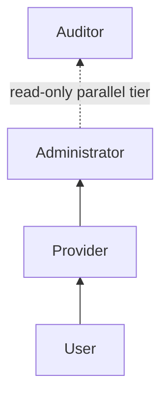
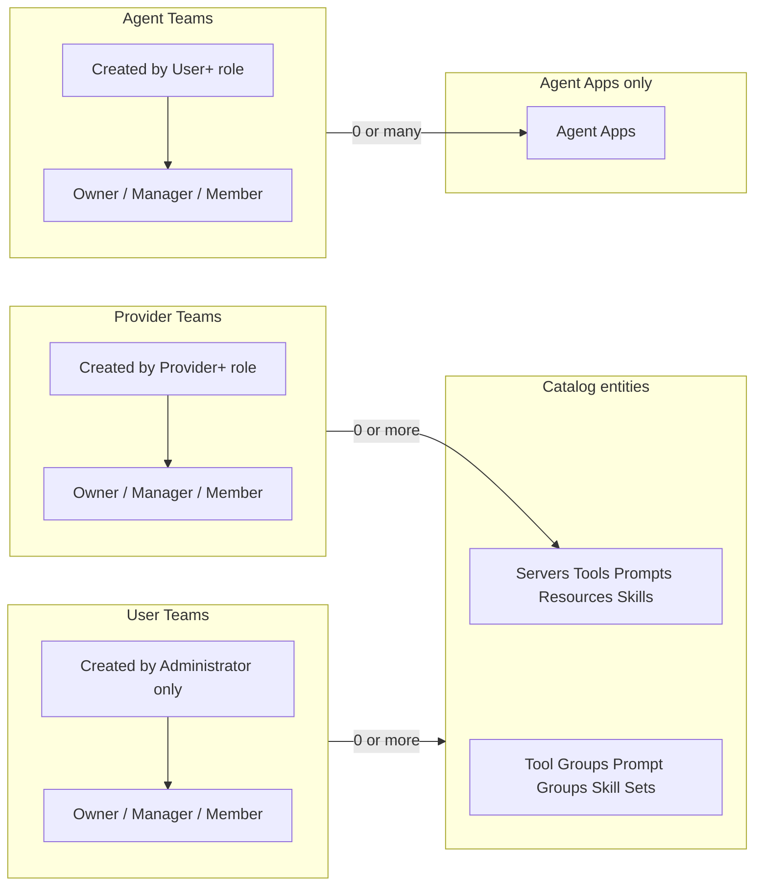
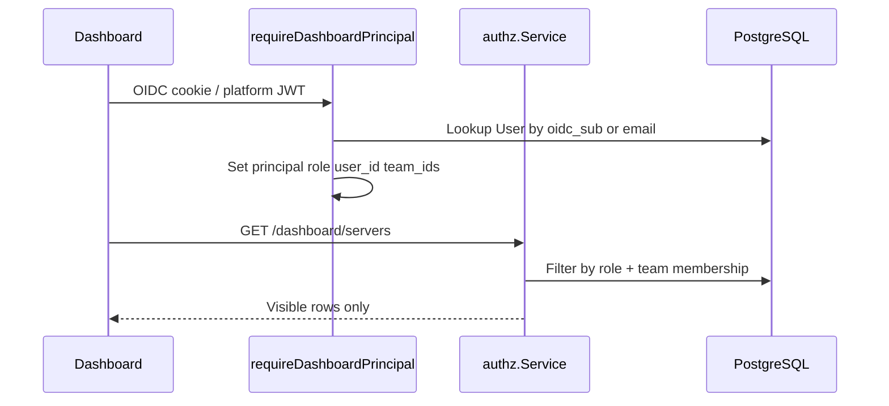

# RBAC Roles and Teams Implementation Plan

## Current state

The gateway has **no working human RBAC** today:

- Only `admin` / `user` in [`pkg/types/user.go`](pkg/types/user.go) and [`internal/model/user.go`](internal/model/user.go)
- [`requireAdminUser`](internal/api/middleware.go) is a no-op; dashboard JSON routes allow any authenticated session to mutate everything
- **Teams do not exist** — no models, APIs, or UI
- Agent apps are the only scoped resource (`owner_scope_key` in [`internal/model/agent_app.go`](internal/model/agent_app.go))
- Dashboard nav groups are defined in [`web/dashboard/src/lib/navSections.ts`](web/dashboard/src/lib/navSections.ts): **Providers** (servers, tools, prompts, resources, skills), **Products** (tool groups, prompt groups, skill sets), **Agent Apps**, **System** (observability, lineage, diagnostics)

This plan adds role + team enforcement **primarily on `/dashboard/*` routes** (enterprise/OIDC mode). The existing `GLOBAL_MCP_API_KEY` machine path stays unchanged unless you later want parity.

---

## Target access model

### Role hierarchy (gateway DB)

Roles are **cumulative** — higher roles inherit all privileges of lower roles:



| Role | Inherits | Additional privileges |
|------|----------|----------------------|
| **User** | — | See entities per User-team rules; create/manage **own** Agent Apps |
| **Provider** | **All User privileges** | Create/manage Provider + Product items (Provider-team scoped on Provider entities); create Provider Teams |
| **Administrator** | **All Provider privileges** (and therefore User) | Manage Users + role assignment; create User Teams; System section access. **Agent Apps exception**: for apps the admin did not create, visibility is limited to apps assigned to Agent Teams where admin is Owner/Manager/Member |
| **Auditor** | — (separate read-only tier, not in write hierarchy) | Read-only view of everything including Users/roles and System |

Implement in `internal/authz` via ordered role rank, e.g. `HasAtLeast(role, UserRoleProvider)` — never duplicate permission checks per role.

**Default role**: Every authenticated dashboard user without an explicit role assignment is treated as **`user`**. This applies when:
- No gateway `User` record exists yet on first OIDC/JWT login → auto-provision with role `user`
- A `User` record exists but `role` is empty/null → resolve as `user` at principal build time
- DB column default for `role` is `user`

Higher roles (`provider`, `administrator`, `auditor`) are **always explicit assignments** by an Administrator (see bootstrap exception below).

Migrate existing `admin` → `administrator`, `user` → `user`.

### Effective permissions by role

| Capability | User | Provider | Administrator | Auditor |
|------------|------|----------|---------------|---------|
| See catalog entities (User-team rules) | yes | yes | yes | yes (read) |
| CRUD own Agent Apps | yes | yes | yes (owner) | no |
| See others' Agent Apps | via Agent Team membership | via Agent Team membership | via Agent Team membership (not global) | read if visible |
| Assign Agent Apps to Agent Teams | yes (own apps) | yes (own apps) | yes (own apps) | no |
| CRUD Provider + Product items | no | yes (Provider-team scoped) | yes (bypasses Provider-team filters) | no |
| Create Provider Teams | no | yes | yes | no |
| Create User Teams | no | no | yes | no |
| Create Agent Teams | yes | yes | yes | no |
| Manage Agent Team members | owner/manager | owner/manager | owner/manager | no |
| Manage Users / roles | no | no | yes | read only |
| System section | no | no | yes | yes (read) |

### Teams (three types)

All teams share the same membership model. **Owner and Manager are also Members** — visibility and membership checks treat `owner`, `manager`, and `member` as members; managers additionally may add/remove members; owners are the team creator with full team control.



**Provider Team assignment** (Provider-section entities only: servers, tools, prompts, resources, skills):

- **0 teams** → any user with **Provider+** role can see/manage
- **1+ teams** → only Provider+ users who are members of at least one assigned team can see/manage
- **Administrator / Auditor** bypass Provider-team write filters on catalog; Auditor is read-only

**User Team assignment** (catalog entities only — **not Agent Apps**):

- Applies to: servers, skills, tool groups, prompt groups, skill sets (tools/prompts/resources inherit from server)
- **0 teams** → any logged-in user can **see**
- **1+ teams** → only members of at least one assigned team can **see**
- Write permissions still gated by role rank (User cannot write Provider items; Provider+ can)

**Agent Team assignment** (Agent Apps **only** — apps cannot be assigned to User or Provider teams):

- Created by **User+** role; creator becomes **Owner**
- An app may be assigned to **0 or many** Agent Teams
- **0 Agent Teams** → app visible/manageable by **owner only** (`owner_scope_key` match)
- **1+ Agent Teams** → app visible to **owner** plus all **members** (owner/manager/member) of any assigned Agent Team
- **Managers** on an Agent Team may add/remove members
- **Administrator** inherits User app privileges but does **not** get global visibility of all agent apps — for apps they did not create, same Agent Team membership rules apply
- **Auditor**: read-only; sees apps visible under the rules above

**Catalog inheritance**: tools, prompts, and resources inherit team assignments from their parent **server**. Skills, groups, and sets are assigned directly. Agent Apps use **Agent Teams only**.

---

## Architecture



New package: **`internal/authz/`** — single place for `CanRead`, `CanWrite`, `FilterList`, and SQL filter builders. Handlers call authz instead of duplicating logic.

---

## Phase 1 — Data model and user linking

### 1.1 Extend roles

[`pkg/types/user.go`](pkg/types/user.go):

```go
const (
  UserRoleAdministrator UserRole = "administrator"
  UserRoleProvider      UserRole = "provider"
  UserRoleUser          UserRole = "user"
  UserRoleAuditor       UserRole = "auditor"
)
```

Add migration mapping `admin` → `administrator` in [`internal/migrations/migration.go`](internal/migrations/migration.go).

### 1.2 Extend User model

[`internal/model/user.go`](internal/model/user.go) — add identity linkage for dashboard sessions:

- `Email` (nullable, indexed `ux_user_tenant_email`)
- `OIDCSub` (nullable, indexed `ux_user_tenant_oidc_sub`)
- `Role` — defaults to `user`; only set to `provider`, `administrator`, or `auditor` via admin assignment
- Keep `Username` + `AccessToken` for CLI/API compatibility
- At least one of `Username`, `Email`, `OIDCSub` required for dashboard users

### 1.3 New models

| Model | Purpose |
|-------|---------|
| `Team` | `tenant_id`, `name`, `type` (`provider` \| `user` \| `agent`), `created_by_user_id` |
| `TeamMember` | `team_id`, `user_id`, `role` (`owner` \| `manager` \| `member`); unique `(team_id, user_id)`. **Owner and manager rows count as members** for visibility (`IsMember()` returns true for all three roles) |
| `TeamResourceAssignment` | `team_id`, `resource_type`, `resource_name`, `tenant_id`; unique `(team_id, resource_type, resource_name)` |

`resource_type` enum: `server`, `skill`, `tool_group`, `prompt_group`, `skill_set`, `agent_app`.

**Assignment constraints by team type:**

| Team type | Assignable resources |
|-----------|---------------------|
| `provider` | `server`, `skill` (catalog provider entities) |
| `user` | `server`, `skill`, `tool_group`, `prompt_group`, `skill_set` |
| `agent` | `agent_app` **only** |

Register in GORM auto-migrate alongside existing models.

### 1.4 Services

- [`internal/service/user/user.go`](internal/service/user/user.go) — extend `CreateUser` to accept role (default `user`); add `GetByOIDCSub`, `GetByEmail`, `UpsertFromDashboardSession` (auto-provision with role `user`)
- **New** `internal/service/team/team.go` — CRUD teams, membership, assignment junctions
- **New** `internal/authz/authz.go` — role rank helpers (`HasAtLeast`), permission matrix, list filters (hierarchy-aware: check `>= provider` not `== provider`)

---

## Phase 2 — Dashboard authentication principal

### 2.1 Resolve session → gateway user

Extend [`internal/api/ui_auth.go`](internal/api/ui_auth.go) / new `dashboard_principal.go`:

1. After `validDashboardUserFromRequest`, lookup `User` by `OIDCSub` then `Email`
2. If no record exists, **auto-provision** a gateway user with role **`user`** (email/sub from session; no login block)
3. Resolve effective role: stored role if set, otherwise **`user`**
4. **Optional bootstrap** (env e.g. `BOOTSTRAP_ADMIN_EMAIL` / `BOOTSTRAP_ADMIN_SUB`): on first match only, provision or upgrade that identity to `administrator` so an initial operator can assign roles — all other users remain default `user`
5. Store `DashboardPrincipal` on Gin context: `{UserID, Role, TeamMemberships[]}`

Add middleware **`requireDashboardPrincipal`** chained after `requireOIDCSessionIfEnabled` on all `/dashboard/*` JSON routes in [`internal/api/server.go`](internal/api/server.go).

Dev mode (no OIDC): map `dev:dashboard` to a configured dev user; default role `user` unless dev config specifies otherwise.

### 2.2 Session API

Extend [`types.DashboardAuthStatusResponse`](pkg/types/) (used by [`dashboardAuthStatusHandler`](internal/api/dashboard.go)):

```json
{
  "authenticated": true,
  "email": "...",
  "sub": "...",
  "role": "user",
  "teams": [{ "id": "...", "name": "...", "type": "provider", "member_role": "manager" }]
}
```

Add **`GET /dashboard/me`** returning the same principal payload for the SPA.

---

## Phase 3 — Authorization enforcement (backend)

### 3.1 Middleware helpers

New middleware in [`internal/api/middleware.go`](internal/api/middleware.go):

- `requireRole(roles ...)` — 403 if principal role not in set
- `requireWriteAccess(resourceType, nameFromParam)` — authz check before mutation handlers
- `rejectAuditorWrites()` — global guard: Auditor always 403 on POST/PUT/PATCH/DELETE

Wire `requireAdminUser` to real role check (`administrator` only) for legacy `/api/v0` admin routes if desired later.

### 3.2 List filtering

Update dashboard list handlers and services to accept `DashboardPrincipal` and apply filters:

| Handler area | File(s) | Change |
|--------------|---------|--------|
| Servers, tools, prompts, resources | [`internal/service/dashboard/service.go`](internal/service/dashboard/service.go), [`internal/api/dashboard.go`](internal/api/dashboard.go) | Provider-team + User-team filters; tools/prompts/resources inherit server teams |
| Skills | [`internal/api/dashboard_skills.go`](internal/api/dashboard_skills.go) | Direct assignment |
| Tool/prompt groups, skill sets | `dashboard_tool_groups.go`, etc. | Direct assignment |
| Agent apps | [`internal/api/dashboard_agent_apps.go`](internal/api/dashboard_agent_apps.go) | Owner always sees own apps; others see app if member of any assigned Agent Team; assign only to `agent` teams; Admin has no global app list beyond owner + agent-team membership |

### 3.3 Mutation guards

Before create/update/delete on any entity:

1. Role rank allows action via `HasAtLeast` (e.g. `>= provider` for server mutations; `>= user` for own agent apps and agent team creation)
2. Provider-team check for Provider-section writes when role is Provider (Administrator bypasses)
3. Auditor → always deny writes (parallel tier, not in hierarchy)
4. Team assignment changes by type: `>= provider` for provider teams; Administrator only for user teams; `>= user` for agent teams on own agent apps; team Owner/Manager can manage members and assign resources to their team
5. Reject assigning `agent_app` resources to non-`agent` teams (and vice versa) at API validation layer

### 3.4 User and role management API (Administrator only)

New dashboard routes (not just legacy `/api/v0/users`):

- `GET/POST/PATCH/DELETE /dashboard/users`
- `PATCH /dashboard/users/:id/role`
- `GET/POST/PATCH/DELETE /dashboard/teams`
- `POST/DELETE /dashboard/teams/:id/members`
- `PUT /dashboard/teams/:id/assignments` (bulk resource assignment)

Extend [`internal/api/users.go`](internal/api/users.go) service layer; add [`internal/api/dashboard_teams.go`](internal/api/dashboard_teams.go) and [`internal/api/dashboard_users.go`](internal/api/dashboard_users.go).

---

## Phase 4 — Dashboard UI

### 4.1 Auth context

[`web/dashboard/src/lib/auth.ts`](web/dashboard/src/lib/auth.ts) — fetch `/dashboard/me`, expose `role`, `teams`, `canWrite(section)`.

### 4.2 Role-based navigation

[`web/dashboard/src/lib/navSections.ts`](web/dashboard/src/lib/navSections.ts) + [`NavSidebar.tsx`](web/dashboard/src/components/NavSidebar.tsx):

| Section | User | Provider | Administrator | Auditor |
|---------|------|----------|---------------|---------|
| Providers | hidden | yes | yes | yes (read) |
| Products | yes | yes | yes | yes (read) |
| Agent Apps | yes (own + agent-team) | yes (own + agent-team) | yes (own + agent-team) | read |
| Agent Teams | yes | yes | yes | yes (read) |
| System | no | no | yes | yes (read) |
| Users / Provider Teams / User Teams | no | Provider Teams | all team types + Users | yes (read) |

Add nav entries: **Users**, **Teams** (tabbed or filtered by `provider` / `user` / `agent` type).

### 4.3 New UI pages

- **TeamsPage** — list/create teams filtered by type (`provider` / `user` / `agent`), membership table, role badges; managers can add/remove members
- **UsersPage** — list users, assign role, link email/sub (admin only writes)
- **TeamAssignmentFields** — provider/user team multi-select on catalog forms in [`App.tsx`](web/dashboard/src/App.tsx), [`SkillFormPage.tsx`](web/dashboard/src/components/SkillFormPage.tsx)
- **AgentTeamAssignmentFields** — agent team multi-select **only** on agent app create/edit forms

Hide create/edit/delete buttons when `canWrite` is false.

### 4.4 Types

Extend [`web/dashboard/src/lib/types.ts`](web/dashboard/src/lib/types.ts) with `Team`, `TeamMember`, `DashboardPrincipal`, team ID arrays on entity DTOs.

---

## Phase 5 — Testing and docs

### E2E tests (new `internal/e2e/rbac_teams_test.go`)

- Provider with 0 provider teams sees all provider items; with team assignment sees only assigned
- User sees product with 0 user teams; hidden when assigned to user team they're not in
- User CRUD own agent app; assign to Agent Teams; team member sees shared app
- User with 0 agent teams on app: only owner sees it; member added to agent team gains visibility
- Agent team manager adds/removes members; owner and manager both count as members for visibility
- Provider CRUD own agent app **and** can mutate provider/product items (inherits User)
- Administrator inherits Provider server write; sees non-owned agent app only via Agent Team membership
- Auditor GET succeeds, POST returns 403
- Administrator creates user team, adds member, assigns catalog resource
- First OIDC login auto-provisions gateway user with default role `user`
- Administrator explicitly upgrades user to `provider` / `administrator` / `auditor`
- User with default role can create Agent Teams and own Agent Apps; cannot access Providers section
- User creates agent team, assigns own app, adds member who can then read app

### Docs

Update [`docs/governance/clients-and-users.mdx`](docs/governance/clients-and-users.mdx) and add `docs/governance/rbac-and-teams.mdx` describing roles, teams, and assignment semantics.

---

## Key design decisions (locked in from your answers)

- **Default role is `user`**: every logged-in user without an explicit assignment gets `user` (auto-provision on first login included)
- **Role hierarchy**: Provider inherits all User privileges; Administrator inherits all Provider (and User) privileges
- **Three team types**: Provider Teams (catalog provider entities), User Teams (catalog visibility), Agent Teams (Agent Apps only)
- **Agent Apps assign only to Agent Teams** — not User or Provider teams; 0 agent teams = owner-only visibility; 1+ = owner + agent team members
- **Team membership**: Owner and Manager are also Members for visibility checks; Managers may add/remove members
- **Agent Teams** created by User+ role; creator is Owner
- **Administrator Agent Apps**: no global app list — owner access for own apps, Agent Team membership for others' apps
- **User teams apply to catalog entities only** (Providers + Products), not Agent Apps
- **Roles live in gateway DB**, resolved by OIDC `sub` / email at dashboard login — not IdP JWT claims

## Out of scope (unless requested later)

- RBAC on MCP runtime routes (`/{tenant}/mcp`, group proxies) — agent-app credentials remain the runtime model
- RBAC on `/api/v0` REST (still `GLOBAL_MCP_API_KEY`) — can mirror dashboard authz in a follow-up
- Per-tool/prompt/resource team assignment (use server inheritance instead)

## Suggested delivery order

Implement in vertical slices to keep each PR reviewable:

1. **Roles + principal middleware + `/dashboard/me`** (no teams yet; role-only nav gating)
2. **Teams CRUD + membership API/UI**
3. **Resource assignment + list filtering**
4. **User management UI + Auditor read-only enforcement**
5. **E2E + docs**
