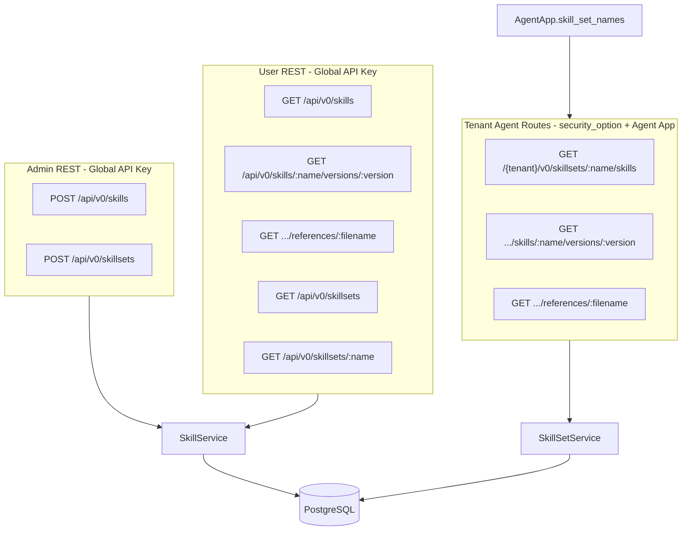
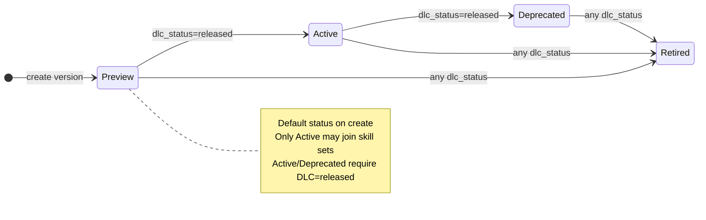
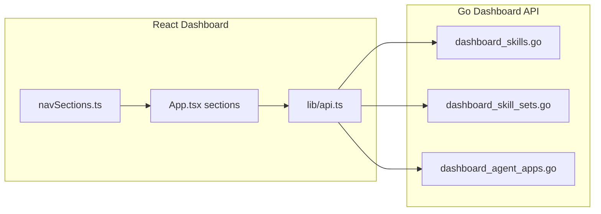

# Skills Catalog API Implementation Plan

## Architecture



**Route prefix:** All paths mount under optional `HTTP_PATH_PREFIX` via existing `setupRouter()` group in [`internal/api/server.go`](internal/api/server.go) (e.g. `{prefix}/api/v0/skills`).

**Auth split** (mirrors tool groups):
- `userAPI` (`/api/v0`, global MCP API key): all GET endpoints
- `adminAPI` (`/api/v0` + `requireAdminUser()`): POST create endpoints
- `tenantMCP` group (`/:tenant_id`, `tenantFromPathMiddleware`): agent-facing skill set routes with `security_option` auth (reuse/extend [`checkAuthForGroupMcpProxyAccess`](internal/api/middleware.go) pattern)

---

## 1. Database Schema

### Versioning model

Skills are split into a **logical identity** (`skills`) and **versioned records** (`skill_versions`). A skill name may have many versions; skill sets reference a specific **skill + version** pair. All spec content (description, body, scripts, references) lives on the version row.



### Lifecycle enums — [`pkg/types/skill_lifecycle.go`](pkg/types/skill_lifecycle.go)

| Field | Values | Default |
|-------|--------|---------|
| `status` | `preview`, `active`, `deprecated`, `retired` | `preview` |
| `dlc_status` | `development`, `testing`, `released` | `development` |
| `locked` | `boolean` | `false` (unlocked) |

**Transition rules (enforced in service layer):**
- `status` → `active` or `deprecated` **only when** `dlc_status == released`
- Skill set membership **only when** `status == active`
- When `locked == true`, reject any mutation of version content (body, scripts, references, metadata, description, license, compatibility, allowed_tools, dlc_status). Allow `status` transitions and explicit lock/unlock via dedicated endpoints.
- `retired` is terminal for skill-set attachment (cannot attach; existing memberships should be blocked on update)

### Raw SQL migration (deliverable)

Create [`internal/migrations/sql/001_skills_catalog.up.sql`](internal/migrations/sql/001_skills_catalog.up.sql):

| Table | Key columns | Constraints |
|-------|-------------|-------------|
| `skills` | `id` UUID PK, `tenant_id`, `name` | `UNIQUE (tenant_id, name)`; name CHECK: `^[a-z0-9]+(-[a-z0-9]+)*$`, length 1–64 |
| `skill_versions` | `id` UUID PK, `skill_id` FK, `version`, spec fields + `body_content`, `status`, `dlc_status`, `locked` | `UNIQUE (skill_id, version)`; version CHECK: semver-like `^[0-9]+(\.[0-9]+)*(-[a-z0-9]+)?$` (VARCHAR 32); status/dlc_status CHECK enums; `locked BOOLEAN NOT NULL DEFAULT false`; `status NOT NULL DEFAULT 'preview'`; `dlc_status NOT NULL DEFAULT 'development'` |
| `skill_sets` | `id` UUID PK, `tenant_id`, `name`, `description`, `security_option` | `UNIQUE (tenant_id, name)`; RBAC parity with tool groups |
| `skill_set_members` | `skill_set_id`, `skill_version_id` | PK `(skill_set_id, skill_version_id)`; FK CASCADE; index on both columns |
| `skill_scripts` | `id` UUID PK, `skill_version_id` FK, `filename`, `code_content` | `UNIQUE (skill_version_id, filename)` |
| `skill_references` | `id` UUID PK, `skill_version_id` FK, `filename`, `markdown_content` | `UNIQUE (skill_version_id, filename)` |

**Version row holds Agent Skills spec fields:**
- `description` VARCHAR(1024) NOT NULL
- `license` TEXT, `compatibility` VARCHAR(500), `metadata` JSONB, `allowed_tools` TEXT[], `body_content` TEXT NOT NULL

**Naming note:** `skill_scripts` / `skill_references` (not bare `scripts` / `references`) to avoid MCP resource collision.

### GORM AutoMigrate (runtime)

Add models in [`internal/model/skill.go`](internal/model/skill.go):

```go
type Skill struct {
    ID       uuid.UUID `gorm:"type:uuid;primaryKey;default:gen_random_uuid()"`
    TenantID string    `gorm:"size:255;not null;default:sami;uniqueIndex:ux_skill_tenant_name"`
    Name     string    `gorm:"size:64;not null;uniqueIndex:ux_skill_tenant_name"`
    Versions []SkillVersion `gorm:"foreignKey:SkillID;constraint:OnDelete:CASCADE"`
}

type SkillVersion struct {
    ID            uuid.UUID `gorm:"type:uuid;primaryKey;default:gen_random_uuid()"`
    SkillID       uuid.UUID `gorm:"type:uuid;not null;uniqueIndex:ux_skill_version"`
    Version       string    `gorm:"size:32;not null;uniqueIndex:ux_skill_version"`
    Description   string    `gorm:"size:1024;not null"`
    Status        string    `gorm:"size:16;not null;default:preview"`
    DLCStatus     string    `gorm:"size:16;not null;default:development;column:dlc_status"`
    Locked        bool      `gorm:"not null;default:false"`
    // license, compatibility, metadata, allowed_tools, body_content
    Scripts    []SkillScript    `gorm:"foreignKey:SkillVersionID;constraint:OnDelete:CASCADE"`
    References []SkillReference `gorm:"foreignKey:SkillVersionID;constraint:OnDelete:CASCADE"`
}
```

Tenant scoping via `skills.tenant_id`; version queries join through `skills` with `dbTenant(ctx)`.

---

## 2. Service Layer

Create two service packages following [`internal/service/toolgroup/toolgroup.go`](internal/service/toolgroup/toolgroup.go):

### [`internal/service/skill/skill.go`](internal/service/skill/skill.go) — `SkillService`

| Method | Purpose |
|--------|---------|
| `CreateSkillVersion(ctx, input)` | Upsert `skills` row by name; insert new `skill_version` + scripts/references in transaction |
| `UpdateSkillVersion(ctx, name, version, input)` | Update content; **reject if locked** |
| `TransitionStatus(ctx, name, version, newStatus)` | Validate DLC gate; apply status change |
| `SetDLCStatus(ctx, name, version, dlcStatus)` | Update DLC; **reject if locked** |
| `SetLocked(ctx, name, version, locked bool)` | Lock/unlock version (always allowed) |
| `ListSkillSummaries(ctx)` | All versions: `name`, `version`, `description`, `status`, `dlc_status` (no body) |
| `GetSkillVersion(ctx, name, version)` | Full version + script/reference filename lists |
| `GetReferenceContent(ctx, name, version, filename)` | On-demand markdown fetch |

### [`internal/service/skillset/skillset.go`](internal/service/skillset/skillset.go) — `SkillSetService`

| Method | Purpose |
|--------|---------|
| `CreateSkillSet(ctx, input)` | Insert set + members; resolve members by `skill_version_id` or `{skill_name, version}` |
| `UpdateSkillSet(ctx, name, input)` | Update description, security_option, members |
| `ListSkillSets(ctx)` | Name + description summaries |
| `GetSkillSetByName(ctx, name)` | Set metadata + members as `{name, version, description, status}` |
| `GetSkillSet(ctx, name)` | Used by auth middleware |

**Skill set member validation:**
- Each member must reference an existing `skill_version_id` OR resolvable `(skill_name, version)` pair
- Referenced version must have `status == active`; reject `preview`, `deprecated`, `retired`
- Duplicate `(skill_name, version)` within a set rejected

### [`internal/service/skill/lifecycle.go`](internal/service/skill/lifecycle.go) — lifecycle helpers

```go
func ValidateStatusTransition(currentStatus, newStatus, dlcStatus string) error
func CanAttachToSkillSet(status string) bool  // status == active
func CanSetActiveOrDeprecated(dlcStatus string) bool  // dlcStatus == released
func IsVersionMutable(locked bool) bool  // !locked
```

### [`internal/service/skill/validate.go`](internal/service/skill/validate.go) — validation helpers

**Skill name** (Agent Skills spec regex):
```go
var ValidSkillName = regexp.MustCompile(`^[a-z0-9]+(-[a-z0-9]+)*$`)
```

**CreateSkillVersion validations:**
1. `name`: 1–64 chars, match `ValidSkillName`
2. `version`: required, match `ValidSkillVersion` (semver-like)
3. `description`: 1–1024 chars (required)
4. `status`: defaults to `preview` if omitted; on create only `preview` allowed (use PATCH to transition)
5. `dlc_status`: defaults to `development` if omitted
6. `compatibility`: if set, 1–500 chars
7. `body_content`: required, non-empty
8. `scripts[].filename` / `references[].filename`: no path separators, unique within type
9. **Body link cross-check** (unchanged from prior plan)
10. **Lock check** on update: if `locked`, reject content/dlc mutations

Skill set **name validation**: reuse `toolgroup.ValidGroupName`.

```go
// Markdown links: [text](references/foo.md), [text](scripts/bar.py)
// Bare paths (spec examples): scripts/run.py on its own line
var (
    mdRefLink    = regexp.MustCompile(`\[[^\]]*\]\((references/[^/\)]+)\)`)
    mdScriptLink = regexp.MustCompile(`\[[^\]]*\]\((scripts/[^/\)]+)\)`)
    bareScript   = regexp.MustCompile(`(?m)^scripts/([^/\s]+)\s*$`)
    bareRef      = regexp.MustCompile(`(?m)^references/([^/\s]+)\s*$`)
)
```

Rules:
- Paths must be **exactly one level deep** (`references/sub/foo.md` rejected by `[^/\)]+`)
- Every extracted filename must exist in payload `scripts` / `references` arrays
- Orphan payload entries (declared but never referenced) are **allowed** (spec progressive disclosure)

Errors wrap `apierrors.ErrInvalidInput` consistent with [`toolgroup.CreateToolGroup`](internal/service/toolgroup/toolgroup.go).

---

## 3. API Types & Handlers

### Types — [`pkg/types/skill.go`](pkg/types/skill.go)

```go
type SkillVersionSummary struct {
    ID          string `json:"id"`
    Name        string `json:"name"`
    Version     string `json:"version"`
    Description string `json:"description"`
    Status      string `json:"status"`       // preview|active|deprecated|retired
    DLCStatus   string `json:"dlc_status"`   // development|testing|released
    Locked      bool   `json:"locked"`
}

type SkillVersionDetail struct {
    SkillVersionSummary
    License, Compatibility, BodyContent string
    Metadata     map[string]string `json:"metadata,omitempty"`
    AllowedTools []string          `json:"allowed_tools,omitempty"`
    Scripts      []string          `json:"scripts"`
    References   []string          `json:"references"`
}

type CreateSkillVersionRequest struct {
    Name, Version, Description, License, Compatibility, BodyContent string
    Status, DLCStatus string  // optional; default preview/development
    Metadata, AllowedTools, Scripts, References ...
}

type UpdateSkillVersionRequest struct { /* same content fields, no name/version change */ }

type TransitionSkillStatusRequest struct {
    Status string `json:"status"`
}

type SetSkillLockRequest struct {
    Locked bool `json:"locked"`
}

type SkillSetMemberInput struct {
    SkillVersionID string `json:"skill_version_id,omitempty"`
    SkillName      string `json:"skill_name,omitempty"`
    Version        string `json:"version,omitempty"`
}

type CreateSkillSetRequest struct {
    Name, Description string
    Members []SkillSetMemberInput `json:"members"`
}
```

### Handlers — [`internal/api/skills.go`](internal/api/skills.go), [`internal/api/skillsets.go`](internal/api/skillsets.go)

Standard handler pattern; version-aware path params.

### Route registration in [`internal/api/server.go`](internal/api/server.go)

**userAPI:**
```
GET  /skills                                          # all version summaries
GET  /skills/:name/versions/:version                  # full version detail
GET  /skills/:name/versions/:version/references/:filename
GET  /skillsets
GET  /skillsets/:name                                 # members include name+version
```

**adminAPI:**
```
POST   /skills                                        # create skill + version
PUT    /skills/:name/versions/:version                # update content (blocked if locked)
PATCH  /skills/:name/versions/:version/status         # lifecycle transition
PATCH  /skills/:name/versions/:version/dlc-status     # DLC transition (blocked if locked)
PATCH  /skills/:name/versions/:version/lock           # lock/unlock
POST   /skillsets
PUT    /skillsets/:name                               # update members (active versions only)
```

**tenantMCP** (agent-runtime):
```
GET /v0/skillsets/:name/skills
GET /v0/skillsets/:name/skills/:skillname/versions/:version
GET /v0/skillsets/:name/skills/:skillname/versions/:version/references/:filename
```
Tenant routes return only **active** versions pinned in the skill set.

Wire `SkillService` and `SkillSetService` into `ServerOptions`, `Server` struct, and [`cmd/start.go`](cmd/start.go) initialization.

---

## 4. RBAC & Agent App Extension

### Skill set `security_option`

Same values as [`pkg/types/group_security.go`](pkg/types/group_security.go): `open`, `api_key`, `basic`, `bearer`. Validated via existing `ValidateGroupSecurityOption()` on create.

### Agent App model — [`internal/model/agent_app.go`](internal/model/agent_app.go)

Add:
```go
SkillSetNames datatypes.JSON `json:"skill_set_names" gorm:"type:jsonb"`
```
Plus `GetSkillSets()` helper mirroring `GetToolGroups()`.

### Attachment validation — [`internal/service/agentapp/agentapp.go`](internal/service/agentapp/agentapp.go)

Update `validateAgentAppGroupAttachment` to enforce **exactly one** attachment among:
- one tool group, OR
- one prompt group, OR
- one skill set

Update `validateAttachedGroups` to verify skill set names exist in DB.

Update `Principal` construction (~line 440) to populate `SkillSets`.

### Principal — [`internal/agentappauth/principal.go`](internal/agentappauth/principal.go)

```go
SkillSets []string
func (p *Principal) AllowsSkillSet(name string) bool
```

### API types — [`pkg/types/agent_app.go`](pkg/types/agent_app.go)

Add `SkillSetNames []string` to `AgentAppPublic`, `CreateAgentAppRequest`, `PatchAgentAppRequest`. Update patch semantics: non-empty `skill_set_names` clears tool/prompt attachments (same mutual-exclusion pattern).

### Middleware — [`internal/api/middleware.go`](internal/api/middleware.go)

Add `checkAuthForSkillSetAccess()` following the `checkAuthForGroupMcpProxyAccess` switch on `security_option` (open / api_key / bearer / basic), calling `principal.AllowsSkillSet(name)`.

---

## 5. Testing

Add [`internal/e2e/skills_test.go`](internal/e2e/skills_test.go) covering:
- Create skill version; create second version of same skill name
- Status defaults to `preview`, DLC defaults to `development`
- Reject `active`/`deprecated` when `dlc_status != released`
- Allow `active`/`deprecated` when `dlc_status == released`
- Skill set rejects non-active version members
- Skill set accepts active version members by `{name, version}` and by `skill_version_id`
- Locked version rejects content update; allows lock/unlock and status transition
- GET list returns summaries with version/status (no `body_content`)
- GET by name+version returns full record
- Tenant-scoped routes serve pinned version only
- Agent app + multi-tenant isolation (unchanged)

Follow patterns from [`internal/e2e/tool_groups_test.go`](internal/e2e/tool_groups_test.go).

---

## 6. Dashboard UI

The dashboard is a React 18 + TypeScript + MUI SPA embedded in Go (`web/dashboard/` → `internal/dashboardui/embed.go`). All product CRUD today lives in the monolithic [`web/dashboard/src/App.tsx`](web/dashboard/src/App.tsx) with hash routing and `/dashboard/*` API calls via [`web/dashboard/src/lib/api.ts`](web/dashboard/src/lib/api.ts).



### 6.1 Dashboard backend handlers

Mirror [`internal/api/dashboard_prompt_groups.go`](internal/api/dashboard_prompt_groups.go) and [`internal/api/dashboard_tool_groups.go`](internal/api/dashboard_tool_groups.go):

**[`internal/api/dashboard_skills.go`](internal/api/dashboard_skills.go)**

| Method | Route | Purpose |
|--------|-------|---------|
| GET | `/dashboard/skills` | List all version summaries (name, version, status, dlc_status, locked) |
| GET | `/dashboard/skills/:name/versions/:version` | Full version detail |
| POST | `/dashboard/skills` | Create skill + version |
| PUT | `/dashboard/skills/:name/versions/:version` | Update content (blocked if locked) |
| PATCH | `/dashboard/skills/:name/versions/:version/status` | Lifecycle transition |
| PATCH | `/dashboard/skills/:name/versions/:version/dlc-status` | DLC update |
| PATCH | `/dashboard/skills/:name/versions/:version/lock` | Lock/unlock |
| DELETE | `/dashboard/skills/:name/versions/:version` | Delete version (blocked if locked or active in a set) |

**[`internal/api/dashboard_skill_sets.go`](internal/api/dashboard_skill_sets.go)**

| Method | Route | Purpose |
|--------|-------|---------|
| GET | `/dashboard/skillsets` | List skill sets with member counts |
| GET | `/dashboard/skillsets/:name` | Set detail + members `{name, version, status}` |
| POST | `/dashboard/skillsets` | Create set with `members[]` |
| PUT | `/dashboard/skillsets/:name` | Update description, security_option, members (active only) |
| DELETE | `/dashboard/skillsets/:name` | Delete set |

Dashboard response DTOs include **tenant catalog endpoint URLs** (like tool groups expose MCP URLs):
- `catalog_endpoint` — `GET /{tenant}/v0/skillsets/:name/skills`
- Per-skill detail and reference URLs for copy-to-clipboard in detail panel

Register routes in [`internal/api/server.go`](internal/api/server.go) under existing `dashboardAPI` group (OIDC/session auth, same as tool groups).

Update [`internal/api/dashboard_agent_apps.go`](internal/api/dashboard_agent_apps.go) to include `skill_set_names` in list/detail/create/patch responses and requests.

### 6.2 Dashboard frontend — navigation & types

**[`web/dashboard/src/lib/types.ts`](web/dashboard/src/lib/types.ts)**
- Extend `AppSection`: add `"skills"` | `"skill_sets"`
- Add `DashboardSkill`, `DashboardSkillSet`, `DashboardCreateSkillInput`, `DashboardCreateSkillSetInput`, etc.
- Extend `DashboardAgentApp` / create/patch inputs with `skill_set_names: string[]`

**[`web/dashboard/src/lib/navSections.ts`](web/dashboard/src/lib/navSections.ts)** — add under **Products** group:
```typescript
{ key: "skills", label: "Skills" },
{ key: "skill_sets", label: "Skill Sets" },
```

**[`web/dashboard/src/lib/hashRoute.ts`](web/dashboard/src/lib/hashRoute.ts)** — hash routes:
- Skills: `#/skills`, `#/skills/:name/versions/:version`, `#/skills/new`, `#/skills/:name/new-version`
- Skill Sets: `#/skill_sets`, `#/skill_sets/:name`, `#/skill_sets/new`, `#/skill_sets/:name/edit`

**[`web/dashboard/src/components/NavSidebar.tsx`](web/dashboard/src/components/NavSidebar.tsx)** — icons for new sections in `SectionIcon()`.

### 6.3 Dashboard frontend — Skills section

Pattern: **list → version detail → modal create/edit**.

**List view** (`App.tsx`, section `skills`):
- Searchable table/card grid grouped by skill `name`, showing all versions as rows
- Columns: `version`, `description` (truncated), `status` badge, `dlc_status` badge, lock icon
- Actions: "Register Skill" (new name + v1), "New Version" (from skill detail)

**Create / edit modal** fields:
- `name` (create only), `version` (create only)
- `description`, `license`, `compatibility`, `metadata`, `allowed_tools`, `body_content`
- Scripts / references sub-forms (disabled when locked)
- Read-only badges for `status`, `dlc_status`, `locked` on edit

**Detail panel** (`#/skills/:name/versions/:version`):
- Status + DLC badges with **transition controls**:
  - Status dropdown: Preview → Active → Deprecated → Retired (disabled options when DLC gate fails)
  - DLC dropdown: development → testing → released
  - Lock/Unlock toggle button
- Version history sidebar listing other versions of same skill name
- Markdown preview, script/reference viewers
- Edit button (disabled when locked)
- Copy versioned API URLs

**Version picker UX:** When adding a version to an existing skill, pre-fill `name` and focus on `version` field.

### 6.4 Dashboard frontend — Skill Sets section

Pattern: **list → detail → modal create/edit**.

**List view:** Card grid with name, description, member count, security badge.

**Create/Edit modal:**
- `name`, `description`, `security_option`
- **Dual-pane member picker** showing `{skill_name, version}` pairs:
  - Left pane: only **active** versions (filter inactive/locked-out with tooltip explaining why)
  - Right pane: selected members
  - Display format: `pdf-processing @ 1.2.0` with status badge

**Detail panel:**
- Member table: name, version, description, status
- Catalog endpoints include version in paths
- Edit / Delete actions

### 6.5 Dashboard frontend — Agent Apps extension

Update agent app create/edit modal in [`App.tsx`](web/dashboard/src/App.tsx) (~6012–6142):

**Attachment XOR** — extend from tool-group OR prompt-group to **exactly one of three**:
- Tool Group `<Select>`
- Prompt Group `<Select>`
- Skill Set `<Select>` (new, populated from `data.skillSets.skill_sets`)

Selecting any one clears the other two (same pattern as existing mutual exclusion).

Validation in `submitAgentAppModal()`:
```typescript
const attached = [toolGroup, promptGroup, skillSet].filter(Boolean).length;
attached === 1
```

Detail panel shows attached skill set name and catalog endpoint URLs via new `renderAgentAppSkillSetEndpoints()` (parallel to `renderAgentAppGroupEndpoints()`).

**[`web/dashboard/src/lib/api.ts`](web/dashboard/src/lib/api.ts)** — add:
```typescript
skills: () => requestJSON<DashboardSkillsResponse>("/dashboard/skills"),
getSkillVersion: (name, version) => requestJSON(...),
createSkillVersion, updateSkillVersion,
transitionSkillStatus, setSkillDLCStatus, setSkillLock, deleteSkillVersion,
skillSets: () => requestJSON<DashboardSkillSetsResponse>("/dashboard/skillsets"),
createSkillSet, updateSkillSet, deleteSkillSet,
```
Extend `createAgentApp` / `patchAgentApp` payloads with `skill_set_names`.

### 6.6 Dashboard build

After frontend changes, rebuild embedded assets via existing `scripts/build-dashboard.sh` so `internal/dashboardui/dist` picks up the new UI.

---

## 7. Files to Create / Modify

| Action | File |
|--------|------|
| Create | `internal/migrations/sql/001_skills_catalog.up.sql` |
| Create | `internal/model/skill.go` |
| Create | `internal/service/skill/skill.go`, `validate.go` |
| Create | `internal/service/skillset/skillset.go` |
| Create | `internal/api/skills.go`, `skillsets.go` |
| Create | `pkg/types/skill.go`, `pkg/types/skill_lifecycle.go` |
| Create | `internal/service/skill/lifecycle.go` |
| Create | `internal/e2e/skills_test.go` |
| Create | `internal/api/dashboard_skills.go`, `dashboard_skill_sets.go` |
| Modify | `internal/migrations/migration.go` |
| Modify | `internal/api/server.go` |
| Modify | `internal/api/middleware.go` |
| Modify | `internal/api/dashboard_agent_apps.go` |
| Modify | `cmd/start.go` |
| Modify | `internal/model/agent_app.go` |
| Modify | `internal/service/agentapp/agentapp.go` |
| Modify | `internal/agentappauth/principal.go` |
| Modify | `pkg/types/agent_app.go` |
| Modify | `go.mod` (add `github.com/google/uuid`) |
| Modify | `web/dashboard/src/lib/types.ts` |
| Modify | `web/dashboard/src/lib/api.ts` |
| Modify | `web/dashboard/src/lib/navSections.ts` |
| Modify | `web/dashboard/src/lib/hashRoute.ts` |
| Modify | `web/dashboard/src/components/NavSidebar.tsx` |
| Modify | `web/dashboard/src/App.tsx` (skills + skill sets sections, agent app modal) |
| Modify | `web/dashboard/src/styles.css` (reuse existing picker/endpoint classes) |

**Out of scope** (not requested): CLI client methods, MCP proxy servers for skill sets (skill sets are catalog groupings, not MCP tool proxies).
